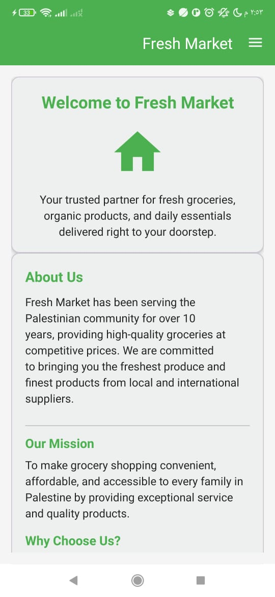
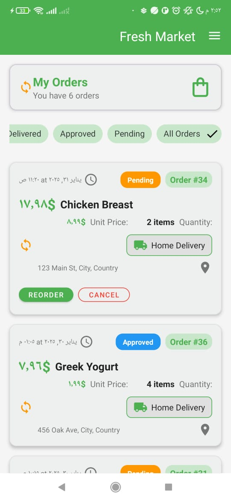
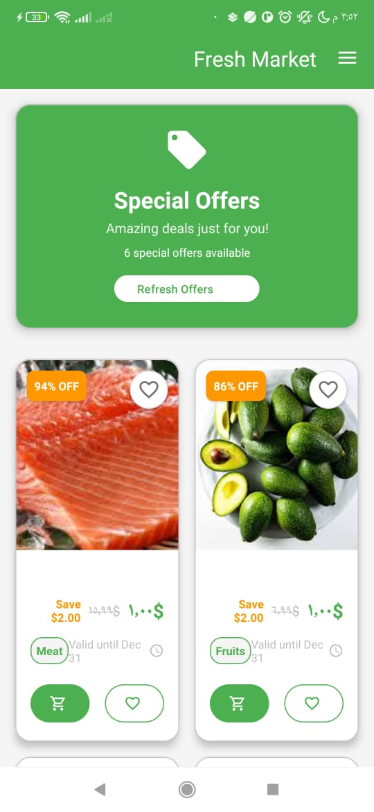
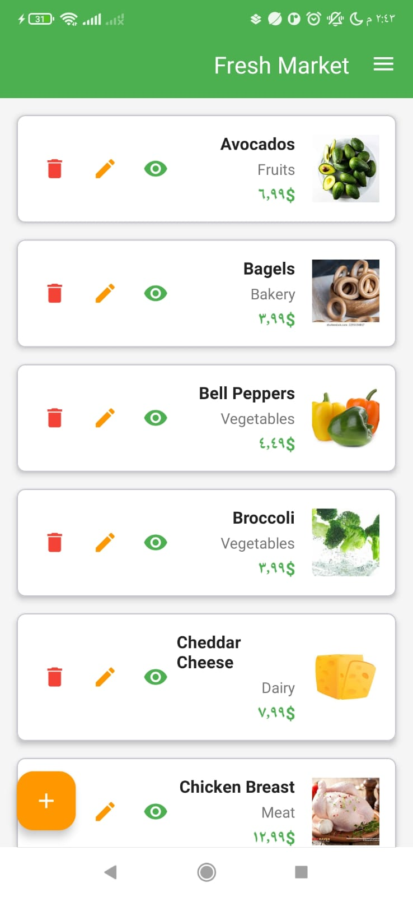
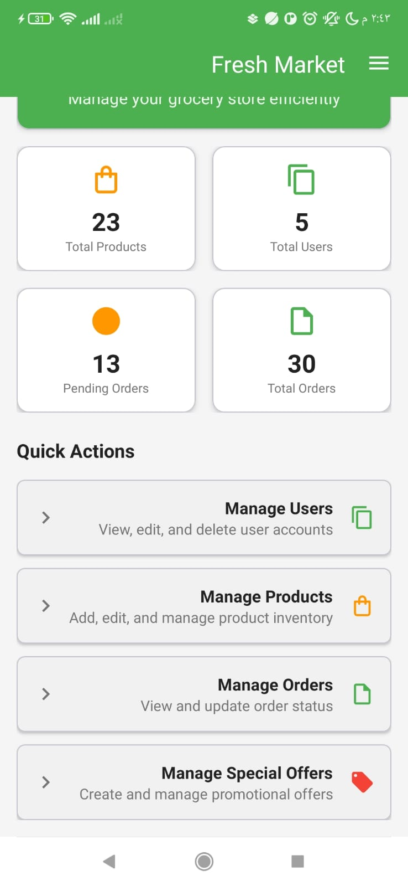
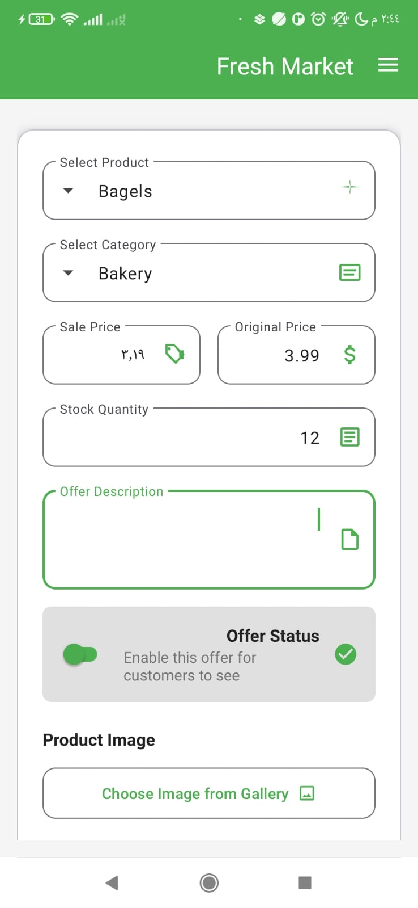

# 🛒 Grocery Store Android App

A modern Android application for grocery store management, supporting both regular users and admin functionality, with modern UI and advanced features.

---


## 🚀 **App Features**

### 👤 **For Regular Users**

- **Login and Registration system**
- **Browse products by category (Vegetables, Fruits, Dairy, Bakery)**
- **Add products to favorites**
- **Order products and special offers**
- **View special offers section**
- **View product details with image, price, and stock**
- **Modern and intuitive user interface**

### 🛠️ **For Admin**

- **Admin-specific login system**
- **Add/Edit/Delete products**
- **Create special offers with product dropdown selection**
- **Manage special offers (enable/disable/edit)**
- **View and manage orders**

### 🌐 **REST API Integration**

- **Connect Button in Introduction Screen:**
  - Fetches product data from REST API: [mocki.io/v1/cede0a18-239c-4370-a84f-93fd197c5111](https://mocki.io/v1/cede0a18-239c-4370-a84f-93fd197c5111)
  - On Success: Navigates to Login screen
  - On Failure: Shows error toast message

### 🎨 **Design & User Interface**

- Animated splash screen
- Introduction screen with connect button
- Consistent color scheme (Green/Orange)
- Dark mode support
- Real product images
- Clear error messages and toast notifications

---

## 🎥 **Video Demo**

### 📱 **App Demonstration**
Watch the complete app walkthrough showing all features:


[**🎬 Video Demo:** [Download and Watch Demo Video]


https://github.com/user-attachments/assets/21a99dcc-99ac-45f3-ac4a-e8b98beec228


**🎬 Demo Includes:**
- **Splash Screen Animation** - App startup with custom logo
- **REST API Connection** - Connect button functionality
- **User Authentication** - Login and registration process
- **Product Browsing** - Category-wise product display
- **Favorites System** - Adding/removing favorite products
- **Special Offers** - Creating and managing offers
- **Database Operations** - Real-time data handling

### 📹 **How to Add Your Video:**
1. **Record your app demo** (MP4 format, under 25MB)
2. **Add video file** to repository root as `demo.mp4`
3. **GitHub will automatically display** the video in README

**Alternative: Using GitHub Releases**
For larger videos (25MB+):
1. Go to **Releases** in your GitHub repo
2. **Create new release** and attach video file
3. **Copy the download URL** and embed in README

### 📹 **Quick Preview**
> **Note:** Add your demo video as `demo.mp4` in the repository root folder

**📋 Video Requirements:**
- **Format:** MP4, MOV, or WEBM
- **Size:** Under 25MB (GitHub limit)
- **Duration:** 2-5 minutes recommended
- **Resolution:** 720p or 1080p

**🎬 Recording Tips:**
- Show app startup and splash screen
- Demonstrate user login/registration
- Browse products and add to favorites
- Show admin panel features
- Include REST API connection demo

### 📸 **Screenshots**
<table>
  <tr>
    <td align="center"><b>Dashbord User Screen</b></td>
    <td align="center"><b>My order </b></td>
    <td align="center"><b>offers</b></td>
  </tr>
  <tr>
    <td></td>
    <td></td>
    <td></td>
  </tr>
  <tr>
    <td align="center"><b>Products</b></td>
    <td align="center"><b>Admin Panel</b></td>
    <td align="center"><b>Offers</b></td>
  </tr>
  <tr>
    <td></td>
    <td></td>
    <td></td>
  </tr>
</table>


---

## 🗂️ **App Flow**

1. **SplashActivity** → Animated splash screen
2. **IntroductionActivity** → Introduction screen with Connect button
3. **LoginActivity / RegistrationActivity** → Login or create account
4. **MainActivity**
   - For Users: Browse products, offers, favorites
   - For Admin: Manage products and offers

---

## 🗄️ **Database Structure**

- **Local SQLite Database**
- Tables: Users, Products, Offers, Orders, Favorites
- Duplicate prevention in favorites
- Offers linked to products via product_id

---

## 🛠️ **Tech Stack**

- **Programming Language:** Java
- **UI Framework:** Android Views + Material Design 3
- **Networking:** Retrofit + Gson
- **Database:** SQLite
- **Build System:** Gradle (Kotlin DSL)
- **Min SDK:** API 26 (Android 8.0)
- **Target SDK:** API 36

---

## 📦 **Installation & Setup**

### Prerequisites

- Android Studio Arctic Fox or later
- JDK 11 or later
- Android SDK API 26+

### Steps

1. Clone the repository:
   ```bash
   git clone https://github.com/HasanQarmash/GroceryStore.git
   ```
2. Open project in Android Studio
3. Wait for Gradle sync to complete
4. Run the app on emulator or physical device

### Running the App

- **Emulator**: Create AVD with API 34+ (recommended)
- **Physical Device**: Enable USB debugging in Developer Options

---

## � **Key Components**

### Activities

- `SplashActivity` - Animated splash screen with logo
- `IntroductionActivity` - Welcome screen with REST API integration
- `LoginActivity` - User authentication
- `RegistrationActivity` - New user registration
- `MainActivity` - Main navigation with drawer

### Fragments

- `ProductsFragment` - Product catalog for users
- `OffersFragment` - Special offers display
- `FavoritesFragment` - User's favorite products
- `ManageProductsFragment` - Admin product management
- `ManageSpecialOffersFragment` - Admin offers management

### Key Features

- **Enhanced Favorites System** - Duplicate checking and image loading
- **Admin Product Dropdown** - Easy offer creation with product selection
- **REST API Integration** - Real-time data fetching
- **Custom Logo Integration** - Your logo throughout the app
- **Database Migration** - Automatic schema updates

---

## 🔧 **Project Structure**

```
app/
├── src/main/
│   ├── java/com/example/grocerystore/
│   │   ├── activities/          # Main activities
│   │   ├── fragments/           # UI fragments
│   │   ├── adapters/           # RecyclerView adapters
│   │   ├── models/             # Data models
│   │   ├── database/           # SQLite database helper
│   │   ├── api/                # REST API services
│   │   └── utils/              # Utility classes
│   ├── res/
│   │   ├── layout/             # XML layouts
│   │   ├── drawable/           # Images and icons
│   │   ├── values/             # Colors, strings, dimensions
│   │   └── anim/               # Animations
│   └── AndroidManifest.xml
```

---

## 🚀 **Future Enhancements**

- Shopping cart functionality
- Payment gateway integration
- Push notifications
- Order tracking
- User profile management
- Multi-language support

---

## 📋 **Important Notes**

- All images stored in drawable folder
- .gitignore configured for Android projects
- App designed for future scalability
- Comprehensive error handling and logging

---

## 👨‍💻 **Developer**

- **HasanQarmash** - Full Stack Android Developer

---

## 🤝 **Contributing**

1. Fork the repository
2. Create feature branch: `git checkout -b feature/new-feature`
3. Commit changes: `git commit -am 'Add new feature'`
4. Push to branch: `git push origin feature/new-feature`
5. Submit a Pull Request

---

## 📄 **License**

This project is licensed under the MIT License - see the [LICENSE](LICENSE) file for details.

---

⭐ **If you like this project, please give it a star!**
